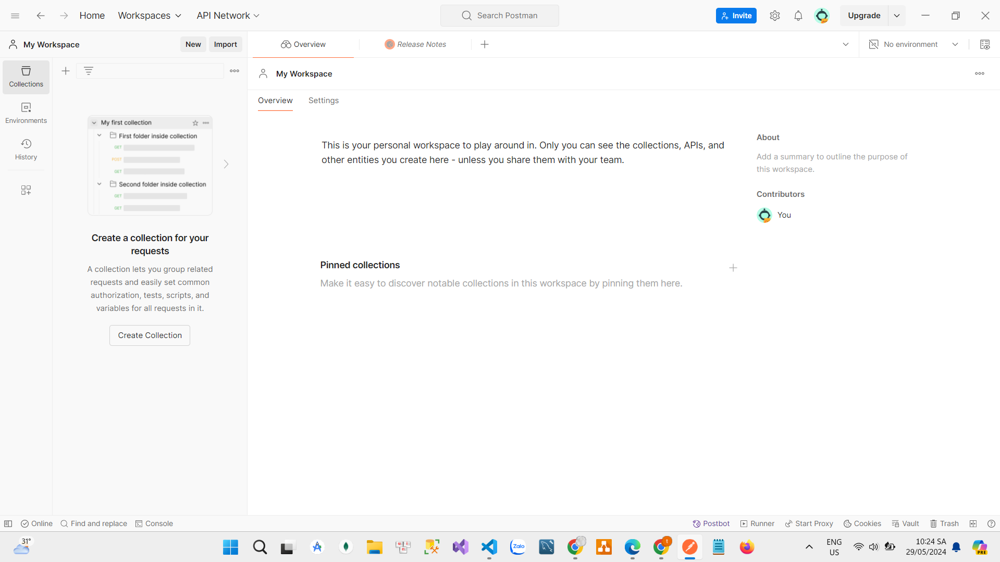
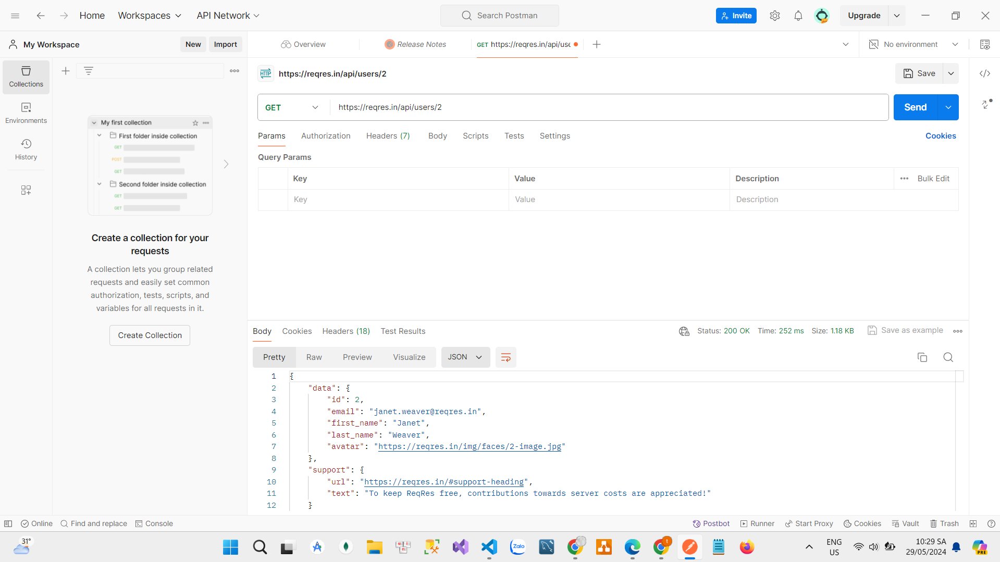
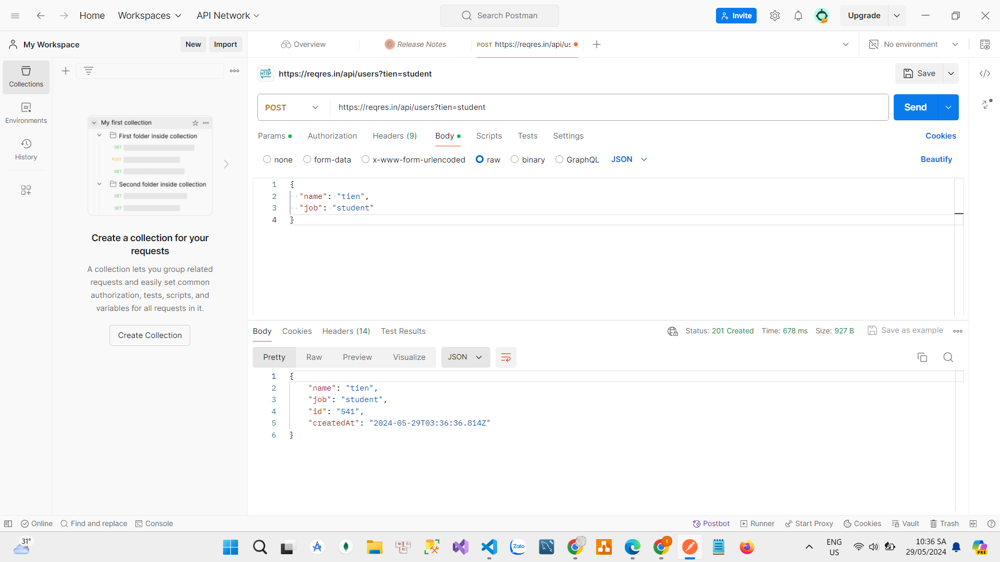
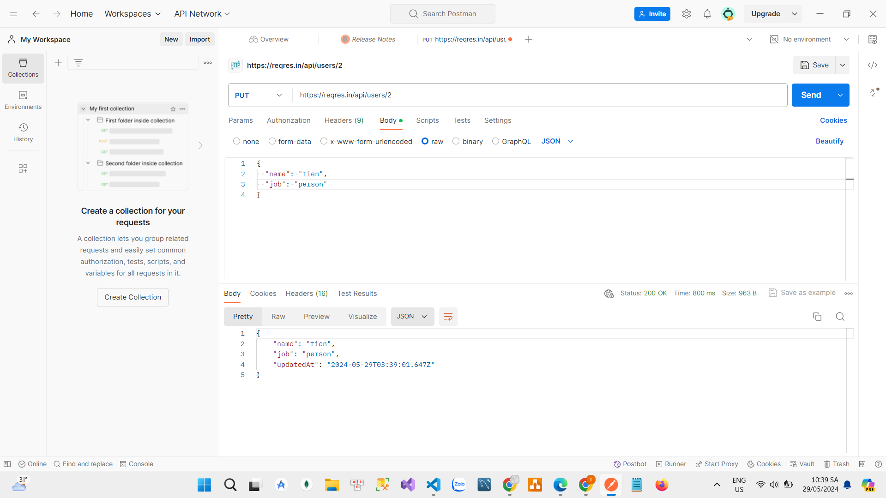
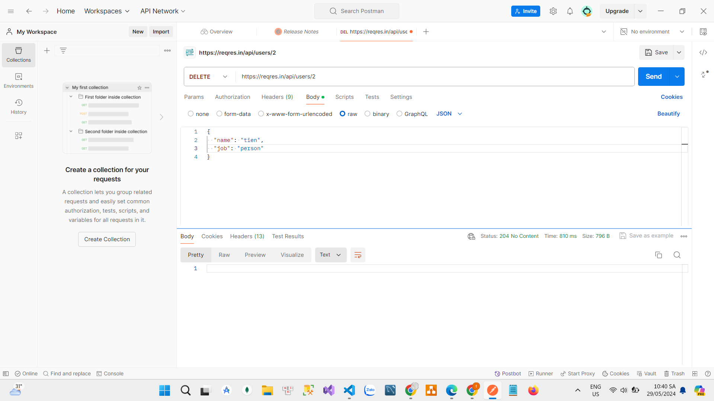

BÁO CÁO BÀI TẬP THỰC HÀNH KIỂM THỬ VỚI POSTMAN
Lê Thị Thủy Tiên - 21013122

1. Giới thiệu Postman
   Postman là một công cụ mạnh mẽ dùng để phát triển và kiểm thử API. Nó cung cấp một giao diện thân thiện và dễ sử dụng cho phép các nhà phát triển gửi yêu cầu HTTP, xem phản hồi và thực hiện các kiểm thử API một cách hiệu quả. Postman được sử dụng rộng rãi trong cộng đồng phát triển phần mềm nhờ vào tính năng phong phú và khả năng hỗ trợ nhiều phương thức HTTP.

Các tính năng chính của Postman:

- Gửi các yêu cầu HTTP: Hỗ trợ tất cả các phương thức HTTP như GET, POST, PUT, DELETE, PATCH, và OPTIONS.
- Xem phản hồi: Postman cho phép bạn xem phản hồi.expand_more Bạn có thể xem mã trạng thái HTTP, header, body và nội dung phản hồi.expand_more
- Chạy thử nghiệm tự động (Tests): Viết các kịch bản kiểm thử bằng JavaScript để tự động kiểm tra phản hồi của API.
- Tích hợp CI/CD: Tích hợp với các công cụ CI/CD để tự động kiểm thử trong quy trình phát triển phần mềm.

Giao diện overview:

2. Kiểm thử API cơ bản

- Kiểm thử API GET:
  URL: https://reqres.in/api/users/2
  Mô tả: Lấy thông tin người dùng với ID là 2
  Kết quả:
  

- Kiểm thử API POST:
  URL: https://reqres.in/api/users
  Mô tả: Tạo một người dùng mới.
  Dữ liệu (Body):
  {
  "name": "tien",
  "job": "student"
  }
  Kết quả:
  

- Kiểm thử API PUT:
  URL: https://reqres.in/api/users/2
  Mô tả: Cập nhật thông tin người dùng với ID là 2.
  Dữ liệu (Body):
  {
  "name": "tien",
  "job": "person"
  }
  Kết quả:
  

- Kiểm thử API DELETE:
  URL: https://reqres.in/api/users/2
  Mô tả: Xóa người dùng với ID là 2.
  Kết quả:
  
